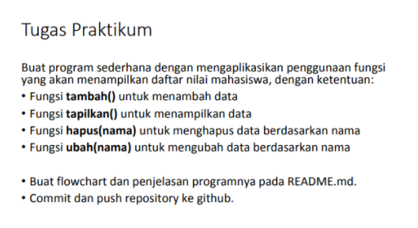
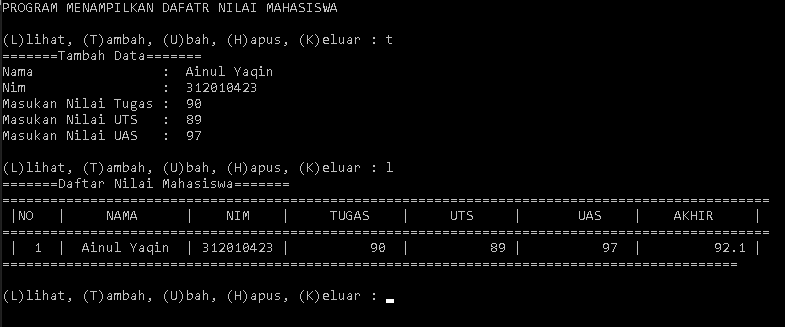

# Nama : Ainul Yaqin  
# NIM : 312010423  
# Kelas : TI.20.A.1

# **Lab6**

  
Pada tugas LAB 6, saya diminta untuk membuat sebuah program menambahkan data ke sebuah list dengan sistem library root yang nantinya akan seperti ini.  

# Berikut Adalah Inputnya

`from data import data`

`print("PROGRAM MENAMPILKAN DAFATR NILAI MAHASISWA")`  
`while True:`  
`    print("")`  
`    c =input("(L)lihat, (T)ambah, (U)bah, (H)apus, (K)eluar : ")`  
`    if c.lower() == 't':`  
`        print("=======Tambah Data=======")`  
`        nama = input("Nama                :  ")`  
`        nim = input("Nim                 :  ")`  
`        tugas = int(input("Masukan Nilai Tugas :  "))`  
`        uts = int(input("Masukan Nilai UTS   :  "))`  
`        uas = int(input("Masukan Nilai UAS   :  "))`  
`        akhir = (0.30 * tugas) + (0.35 * uts) + (0.35 * uas)`  
`        data[nama] = nim, tugas, uts, uas, akhir`  
`    elif c.lower() == 'u':`  
`        print('=======Ubah Data Mahasiswa=======')`  
`        nama = input('Nama                :  ')`  
`        if nama in data.keys():`  
`            nim = input('Nim                 :  ')`  
`            tugas = int(input("Masukan Nilai Tugas :  "))`  
`            uts = int(input("Masukan Nilai UTS   :  "))`  
`            uas = int(input("Masukan Nilai UAS   :  "))`  
`            akhir = (0.30 * tugas) + (0.35 * uts) + (0.35 * uas)`  
`            data[nama] = nim, tugas, uts, uas, akhir`  
`        else:`  
`            print("Data Nilai Tidak Ada".format(nama))`  

`    elif c.lower() == 'l':`  
`        print("=======Daftar Nilai Mahasiswa=======")`  
`        print("================================================================================================")`  
`        print(" |NO   |     NAMA      |    NIM    |     TUGAS    |     UTS     |       UAS    |    AKHIR     | ")`  
`        print("================================================================================================")`  
`        i = 0`  
`        for x in data.items():`  
`            i += 1`  
`            print(`  
`                " | {6:2}  |  {0:12s} | {1:9s} | {2:11}  | {3:11} | {4:11}  |  {5:11} |".format(x[0], x[1][0], x[1][1],`  
`                                                                                                x[1][2], x[1][3],`  
`                                                                                                x[1][4], i))`  
`            print("============================================================================================")`  

`    elif c.lower() == 'h':`  
`        print("=======Hapus Data Mahasiswa=======")`  
`        nama = input("Nama :  ")`  
`        if nama in data.keys():`  
`            del data[nama]`  
`        else:`  
`            print("Data Nilai Tidak Ada".format(nama))`  

`    elif c.lower() == 'k':`  
`        print("Keluar")`  
`        break`  

Dan Setelah Kita Menemukan Hasil Nya Mari Saya Jelaskan Perinciannya

* Langkah pertama yang harus kita lakukan adalah membuat variabel lis kosong.  
`from data import data`

* Setelah itu kita membuat kondisi perulangan dan statement yang akan dijalankan ketika perulangan terjadi. berikut intputnya:  
`print("PROGRAM MENAMPILKAN DAFATR NILAI MAHASISWA")`  
`while True:`  
`    print("")`  
`    c =input("(L)lihat, (T)ambah, (U)bah, (H)apus, (K)eluar : ")`

*  Berikutnya tambahkan inputan Fungsi Tambahkan  
`if c.lower() == 't':`  
`print("=======Tambah Data=======")`  
`        nama = input("Nama                :  ")`  
`        nim = input("Nim                 :  ")`  
`        tugas = int(input("Masukan Nilai Tugas :  "))`  
`        uts = int(input("Masukan Nilai UTS   :  "))`  
`        uas = int(input("Masukan Nilai UAS   :  "))`  
`        akhir = (0.30 * tugas) + (0.35 * uts) + (0.35 * uas)`  
`        data[nama] = nim, tugas, uts, uas, akhir`

* Tambahkan inputan Fungsi Ubah  
`elif c.lower() == 'u':`  
`print('=======Ubah Data Mahasiswa=======')`  
`        nama = input('Nama                :  ')`  
`        if nama in data.keys():`  
`            nim = input('Nim                 :  ')`  
`            tugas = int(input("Masukan Nilai Tugas :  "))`  
`            uts = int(input("Masukan Nilai UTS   :  "))`  
`            uas = int(input("Masukan Nilai UAS   :  "))`  
`            akhir = (0.30 * tugas) + (0.35 * uts) + (0.35 * uas)`  
`            data[nama] = nim, tugas, uts, uas, akhir`  
`        else:`  
`            print("Data Nilai Tidak Ada".format(nama))` 

* Tambahkan inputan Fungsi Tampilkan  
`elif c.lower() == 'l':`  
` print("=======Daftar Nilai Mahasiswa=======")`  
`        print("================================================================================================")`  
`        print(" |NO   |     NAMA      |    NIM    |     TUGAS    |     UTS     |       UAS    |    AKHIR     | ")`  
`        print("================================================================================================")`  
`        i = 0`  
`        for x in data.items():`  
`            i += 1`  
`            print(`  
`                " | {6:2}  |  {0:12s} | {1:9s} | {2:11}  | {3:11} | {4:11}  |  {5:11} |".format(x[0], x[1][0], x[1][1],`  
`                                                                                                x[1][2], x[1][3],`  
`                                                                                                x[1][4], i))`  
`            print("============================================================================================")`

* Tambahkan inputan Fungsi Hapus  
`elif c.lower() == 'h':`  
`print("=======Hapus Data Mahasiswa=======")`  
`        nama = input("Nama :  ")`  
`        if nama in data.keys():`  
`            del data[nama]`  
`        else:`  
`            print("Data Nilai Tidak Ada".format(nama))`

* Tambahkan inputan Fungsi Keluar  
`elif c.lower() == 'k':`  
`print("Keluar")`  
`        break`

# Berikut ini adalah Outputnya :
